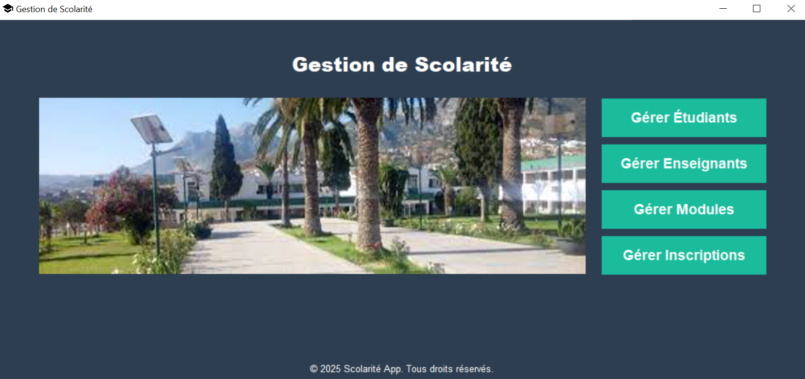
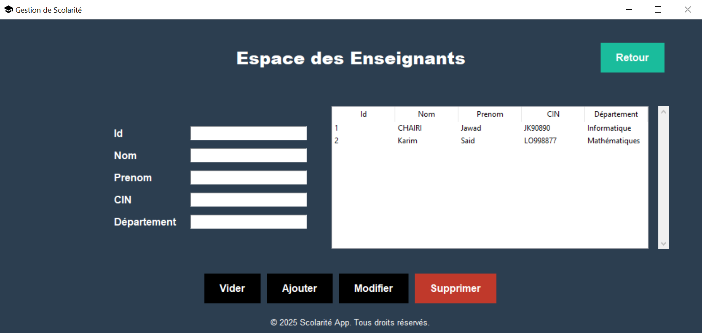
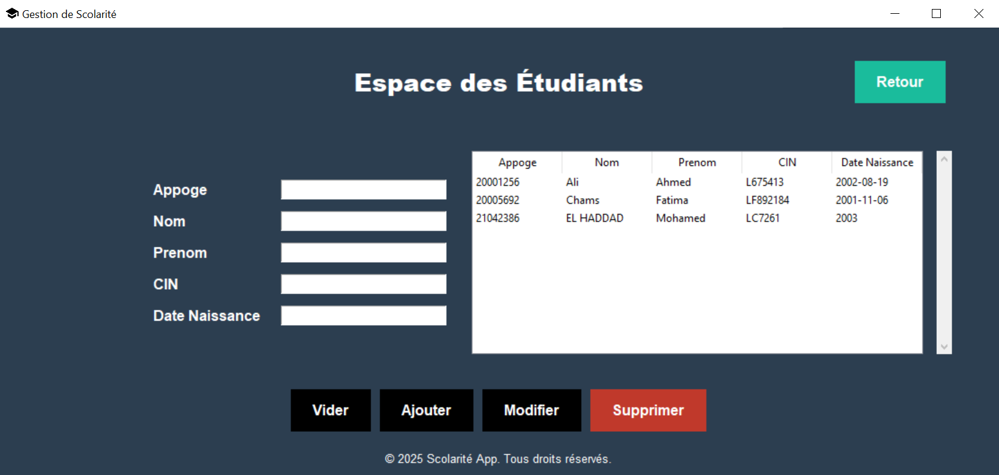
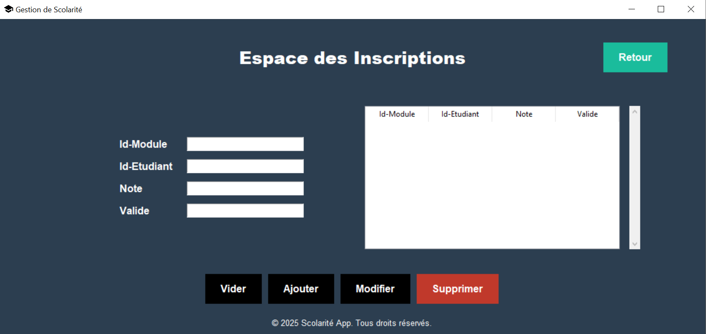

Here’s the updated README with Tkinter and XML replacing PyQt6 and SQLite3:

---

## **School Management - Desktop Application**  

### **Description**  
The School Management application is a desktop software built using **Tkinter** for the graphical user interface and **XML** for data storage. This application is designed to streamline school administrative tasks, including managing student and teacher records, course assignments, and inscription.  

---

### **Features**  
- **Student Management:**  
  - Add, update, and delete student records.  
  - View detailed student profiles.  

- **Teacher Management:**  
  - Add, update, and delete teacher records.  
  - Assign teachers to courses.  

- **Course Management:**  
  - Create and manage courses.  
  - Assign students and teachers to courses.  

- **Grades and Attendance:**  
  - Record and manage student grades and attendance.   

- **User-Friendly Interface:**  
  - Intuitive and responsive UI using Tkinter components.  

---

### **Technologies Used**  
- **Python 3.13.1**  
- **Tkinter** for the Graphical User Interface.  
- **XML** for data storage.  

---

### **Prerequisites**  
Make sure you have the following installed:  
- **Python 3.13.1**  
- **Tkinter** library.  

Tkinter is included with Python, so no additional installation is required.  

---

### **Usage**  
1. Launch the application using the command mentioned above.  
2. Navigate through the menu options for managing students, teachers, courses, and inscription.  

---

### **Screenshots**  
### Main

### Teacher Management

### Student Management

### Course Management

### Inscription Management

### **Contact**  
**LinkedIn:** [EL Main Ismail](https://www.linkedin.com/in/ismail-el-main-4823502a4/)  
**GitHub:** [Ismail703](https://github.com/ismail703)

---

Let me know if you need further updates!
